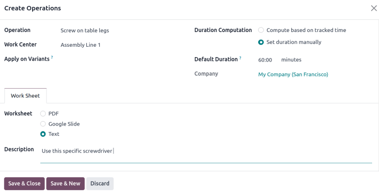
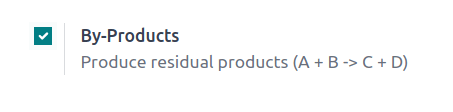

=================
Bill of materials
=================

.. |BOM| replace:: :abbr:`BoM (Bill of Materials)`
.. |BOMs| replace:: :abbr:`BoMs (Bills of Materials)`
.. |list| replace:: :icon:`fa-list-ul` :guilabel:`(list)`

A *bill of materials* (or *BoM* for short) documents specific components, along with their
respective quantities, that are needed to produce or repair a product. In Odoo, |BoMs| as blueprints
for manufactured goods and kits, and often include production operations and step-by-step
guidelines, as well.

BoM setup
=========

To create a |BOM|, go to :menuselection:`Manufacturing app --> Products --> Bills of Materials` and
click :guilabel:`New`.

Next, set the :guilabel:`BoM Type` to :guilabel:`Manufacture this Product`.

Then, specify :ref:`required components <manufacturing/basic_setup/setup-components>` and, if
necessary, define any :ref:`manufacturing operations <manufacturing/basic_setup/setup-operations>`.

.. note::
.. tip::
   Individual |BOMs| can also be quickly accessed or created by clicking the :guilabel:`Bill of
   Materials` smart button on any product form, as accessible through the *Sales*, *Inventory*, and
   *Manufacturing* apps, as well as through any internal links where a product is referenced (such
   as in a field or a line item).
.. figure:: bill_configuration/bom-example.png
   :align: center
   :alt: Show BoM for a product, with components listed.

   BoM for `Drawer`, displaying the **Components** tab.

.. seealso::
   - :doc:`../advanced_configuration/kit_shipping`
   - :doc:`../subcontracting/subcontracting_basic`

.. _manufacturing/basic_setup/setup-components:

Components
----------

In the :guilabel:`Components` tab of a |BOM|, specify components used to manufacture the product by
clicking :guilabel:`Add a line`. From the :guilabel:`Components` drop-down menu, select from
existing products or create a new product by typing the name and selecting either the
:guilabel:`Create " "` option to quickly add the line item, or the :guilabel:`Create and edit...`
option to add the component and continue to it's configuration form.

.. image:: bill_configuration/component.png
   :align: center
   :alt: Add a component by selecting it from the drop-down menu.

.. _manufacturing/basic_setup/setup-operations:

Operations
----------

Add an :guilabel:`Operation` to a |BOM| to specify instructions for production and register time
spent on an operation. To use this feature, first enable the *Work Orders* feature by going to
:menuselection:`Manufacturing app --> Configuration --> Settings`. In the :guilabel:`Operations`
section, tick the :guilabel:`Work Orders` checkbox to enable the feature.

.. seealso::
   :doc:`../advanced_configuration/work_order_dependencies`

.. image:: bill_configuration/enable-work-orders.png
   :align: center
   :alt: "Work Orders" feature in the Settings page.

Next, navigate to the |BOM| by going to :menuselection:`Manufacturing app --> Products --> Bill of
Materials` and selecting the desired |BOM|. To add a new operation, go to the :guilabel:`Operations`
tab, and click :guilabel:`Add a line`.

Doing so opens the :guilabel:`Create Operations` pop-up window, where the various fields of the
operation are configured:

- :guilabel:`Operation`: name of the operation.
- :guilabel:`Work Center`: select existing locations to perform the operation, or create a new work
  center by typing the name and selecting the :guilabel:`Create " "` option.
- :guilabel:`Apply on Variants`: specify if this operation is only available for certain product
  variants. If the operation applies to all product variants, leave this field blank.

  .. seealso::
     :doc:`Configuring BoMs for product variants <../advanced_configuration/product_variants>`

- :guilabel:`Duration Computation`: choose how time spent on the operation is tracked. Opt for
  :guilabel:`Compute based on tracked time` to use the operation's time tracker or :guilabel:`Set
  duration manually` if operators can record and modify time themselves. TODO: Choosing the Compute based on tracked time option enables the Based on last `10` work orders option, which automatically estimates the time to complete this operation based on the last few operations. Choosing Set duration manually enables the Default Duration field instead.
- :guilabel:`Default Duration`: estimated amount of time to complete the operation; used for
  `planning manufacturing orders <https://www.youtube.com/watch?v=TK55jIq00pc>`_ and determining
  `work center availability <https://www.youtube.com/watch?v=3YwFlD97Bio>`_.
- :guilabel:`Company`: specify the company the |BOM| is available in.

Include operation details in the :guilabel:`Work Sheet` tab. Choose :guilabel:`PDF` to attach a file
or :guilabel:`Google Slide` with *public* access to share a link. Select :guilabel:`Text` to type instructions in the
:guilabel:`Description` text field. TODO: Type `/` for a list of formatting options and features, including ChatGPT.

Finally, click :guilabel:`Save \& Close` to close the pop-up window. To add more operations, click
:guilabel:`Save & New` and repeat the same steps above to configure another operation.

.. note::
   Each operation is unique, as it is always exclusively linked to one |BOM|.

.. tip::
   After creating an operation, click the :guilabel:`Copy Existing Operations` button to choose an
   operation to duplicate.

   .. image:: bill_configuration/copy-existing-operations.png
      :align: center
      :alt: Show Operation tab, highlighting the "Copy Existing Operations" field.

Instructions
~~~~~~~~~~~~

.. important::
   To add detailed instructions to operations, the *Quality* app must be installed.

Add specific instructions to an existing operation by clicking the operation's |list| icon in the
:guilabel:`Instructions` column. The number in the :guilabel:`Instructions` column shows the number
of existing detailed instructions there are for the operation.

.. image:: bill_configuration/add-instructions.png
   :align: center
   :alt: Show the Instructions column, and list icon.

On the :guilabel:`Steps` dashboard, click :guilabel:`New` to open a blank quality control point form
where the new manufacturing step can be created. Here, give the specific instruction a
:guilabel:`Title` and set the :guilabel:`Type` to :guilabel:`Instructions`. In the
:guilabel:`Instructions` tab of the form, write out the directions for the step in the operation.

.. note:
   Further customizations can be made here on this form, beyond ordinary instructions, to also
   include specific types of quality control points that carry specific (or complex) conditions. For
   more details about quality control points refer to the following document: :doc:`Instruction
   check <../../quality/quality_check_types/instructions_check>`

.. image:: bill_configuration/steps.png
   :align: center
   :alt: Show the page to add a quality check.

Add by-products to BoMs
=======================

A *by-product* is a residual product that is created during production in addition to the main
product of a |BOM|. Unlike the primary product, there can be more than one by-product on a |BOM|.

To add by-products to a |BOM|, first enable the :guilabel:`By-Products` feature in
:menuselection:`Manufacturing app --> Configuration --> Settings`. In the :guilabel:`Operations`
section, tick the checkbox for :guilabel:`By-Products` to enable the feature.

Once the feature is enabled, add by-products to a |BOM| by clicking the :guilabel:`By-products` tab.
Click :guilabel:`Add a line`, and fill in the :guilabel:`By-product`, :guilabel:`Quantity`, and
:guilabel:`Unit of Measure`. Optionally, specify a :guilabel:`Produced in Operation` for the
by-product.

.. example::
   The by-product, `Mush`, is created in the `Grind grapes` operation when producing `Red Wine`.

   .. image:: bill_configuration/add-by-product.png
      :align: center
      :alt: Show sample by-product in the BoM.
